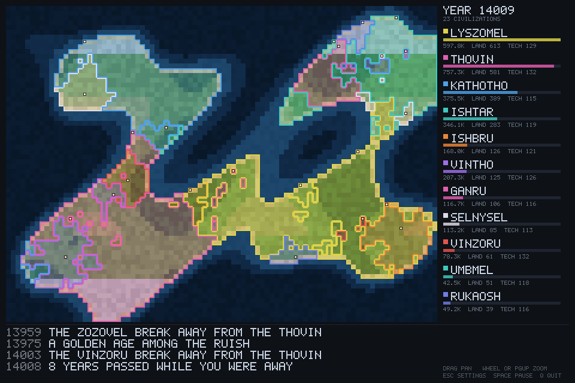
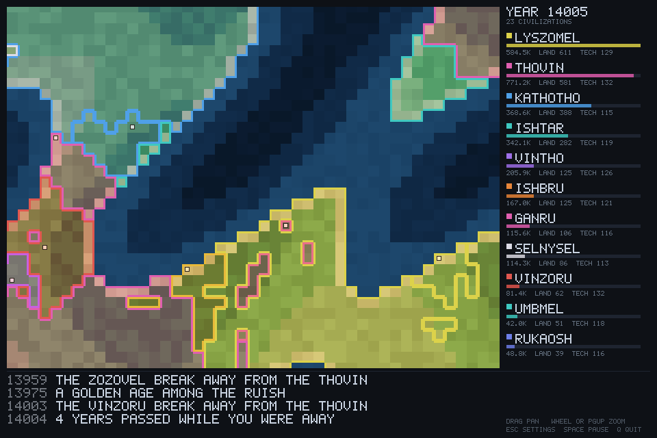
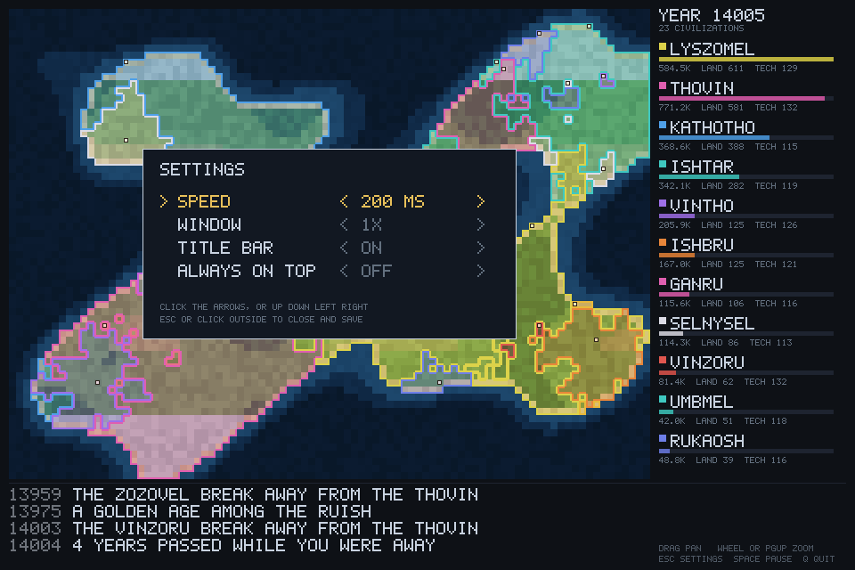

# idle civilizations

A world of civilizations that plays itself in a small window. There is nothing to click.



Zoom in and the provinces get room to breathe. Drag to look around.



`esc` opens the settings, over the paused world.



Peoples grow, discover, spread along their coasts, fight over borders, split apart when
they get too big, and die. You watch. Close it, come back tomorrow, and the world has
moved on without you.

The map is terrain first — water depth, beaches, grass, forest, dry plains, tundra at the
poles, bare highland — with each realm as a light wash over the land it holds plus an
outline in its own colour, and a marker where its city sits.

```
cargo run --release
```

**drag** the map to pan &nbsp;·&nbsp; **wheel** to zoom &nbsp;·&nbsp; arrow keys also pan

`esc` settings &nbsp;·&nbsp; `space` pause &nbsp;·&nbsp; `+` / `-` speed &nbsp;·&nbsp; `q` quit

`--fresh` new world &nbsp;·&nbsp; `--shot out.bmp` save a picture &nbsp;·&nbsp; `--speed 60` &nbsp;·&nbsp; `--scale 2` &nbsp;·&nbsp; `--borderless` &nbsp;·&nbsp; `--topmost`

With no title bar, drag anywhere *outside* the map — the side panel or the chronicle
strip — to carry the window around, since there is no bar to grab.

## settings

`esc` opens a settings screen: speed, window size, title bar, always-on-top. Click the
arrows or use the arrow keys; closing it writes `civ.cfg` next to the executable, which
you can also edit by hand.

The window is never opened larger than your screen — an oversized always-on-top window
with no title bar has no close button and no edges to drag, and just eats the desktop.
Drag-resizing is deliberately off: minifb scales mouse positions by the integer scale
factor only, so a resized window puts every click in the wrong place.

## speed

Measured, not guessed: a simulated year costs **11 µs**, a full redraw **313 µs** — 1.9%
of one 60fps frame, for a picture that changes five times a second. Sitting there
watching costs **0.4% of one core** and 12 MB.

The one thing that was actually wasteful: the loop used to push the whole 2.4 MB
framebuffer to the window every 8 ms whether or not anything had changed, which cost
**3.9% of a core** to display a mostly static image. It now only blits after something
is redrawn and otherwise just pumps input.

## how the idle part works

The save file is one line: `<seed> <year>`. The simulation is deterministic, so resuming
is just replaying from the seed — there is no serializer and no world state on disk. The
years that passed while you were away come from the save file's modification time, capped
at 5000 so a week off doesn't fast-forward an eternity.

## how the world stays interesting

Getting a world that *keeps having history* was the whole problem. Three separate versions
looked fine for a few thousand years and then locked solid forever:

- **tech had to stop feeding people.** With tech linear in carrying capacity, one cell
  eventually feeds millions, a people squeezed to its last province becomes unconquerable,
  and nothing ever dies again.
- **the size penalty had to be quadratic.** A linear one means shrinking makes a realm
  *stronger*, so every world settles into a crystal of equal, immortal statelets.
- **battles had to be decisive.** With linear odds every frontier stays mushy and the map
  never consolidates into anything worth looking at.

The test asserts the world is still turning over at year 40,000 — that some civilization
alive at the end was born in the second half of history.
